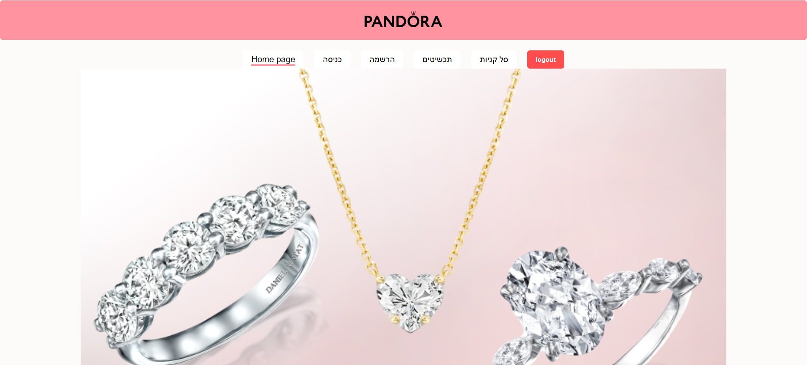
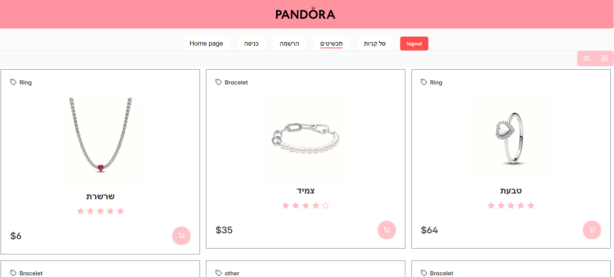
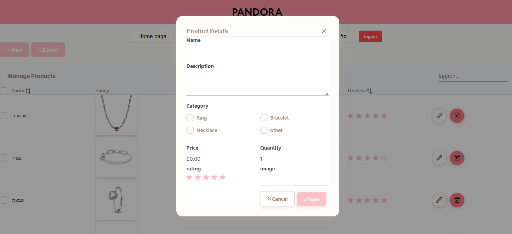
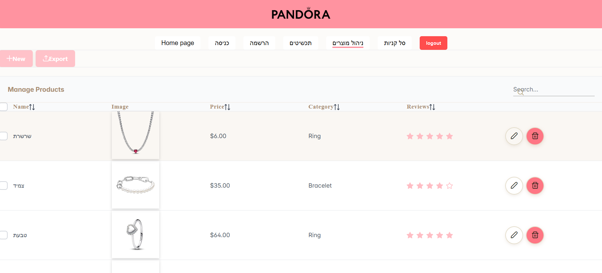

# Jewelry E-Commerce Platform
A full-stack e-commerce platform built with React, Node.js, Express, and MongoDB, featuring secure authentication, role-based access control, product management, and personalized shopping cart functionality.

## Key Features

- User registration and login with JWT authentication
- Secure password hashing using bcrypt
- Role-based authorization (Admin / User)
- Product catalog with grid and list views
- Product management for administrators
- Shopping cart linked to authenticated users
- Personalized cart retrieval
- Add and remove products from the cart
- Protected API routes using middleware
- Redux Toolkit and RTK Query state management
- Responsive UI built with PrimeReact

## Technologies

### Backend
- Node.js
- Express
- MongoDB
- Mongoose
- JWT
- bcrypt
- CORS

### Frontend
- React
- Redux Toolkit
- RTK Query
- React Router
- PrimeReact
- JavaScript
- HTML / CSS

## Business Logic

Administrators can create, update, and delete products through protected routes. Regular users can browse the product catalog and add items to their personal shopping cart after authentication.

Authentication is implemented using JWT tokens, while middleware ensures that only authorized users can access protected resources. Each user can only view and manage their own shopping cart.

## Project Demo


## Screenshots

**Home Page**


**Product Catalog**


**Shopping Cart**


**Admin Panel**


## Getting Started

### Prerequisites

```bash
node --version
npm --version
```
